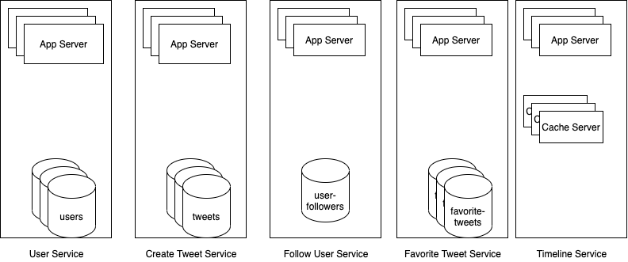

# Requirements and Goal of the system
We will be designing simple version of Twitter with following requirement details.
## Functional requirements
- User should be able to post new tweet
- A user should be able to follow other user
- A user should be able to mark tweet as favorite
- A service should be able to generate users' timeline consisting of top tweets from all the people user follows 
- Tweet can contain photos and videos
## Non functional requirements
- Service needs to be highly available
- Acceptable latency of the system is 200ms for timeline generation
- Consistency can take a hit in the interest of availability; if user doesn't see a tweet for while, it should be fine
## Not in scope
- Searching for tweets
- replying to tweets
- Trending topics - current hot topics/searches 
- Tagging other users 
- Tweet notifications 
- Who to follow? Suggestions?
- Moments 
# Capacity estimation and constraints 
- Total users: 1 billion
- Daily active users: 200 million
- On avg every users makes `1` tweet in two days
- Daily new tweets: 100 million
- On avg, each user follows `200` other users
# High level system design 
Following are proposed micro services
- User service to create users/authenticate users
- Create tweet service to create new tweets
- User follower service to follow other users
- tweet favorite service to mark favorite tweet
- user's timeline service


# API Design
## Create user
```
POST /users?api_key=string
{
    name: string
    email: string
    dob: datetime    
}
``` 
Following will be schema to store user details
```
{
    userId: integer
    name: string
    email: string
    password: string
    dob: datetime  
    createdAt: datetime
    updatedAt: datetime
    lastLogin: datetime  
}
```
## Upload media
```
POST /media?api_key=string&authToken multipart
filename
contentType

Response: 
htpps://media.twitter.com/xxxxxxx
```
## Create tweet
```
POST /tweets?api_key=string&authToken
{
    tweetData: string
    tweetLat: int
    tweetLong: int
    userLat: int
    userLong: int
}
```
## Following users service
```
POST /users/follow?api_key=string&authToken=string
{
    userId: string
}
```
Following will be schema to store user followers
```
{
    userId: int
    followUserId: int
    createdAt: int
    updatedAt: int
}
```
## Mark tweet as favorite
```
POST /tweets/favorite/<tweetId>?api_key=string&authToken=string
```
Following will be schema to store favorite tweet
```
{
    tweetId: int
    userId: int
    createdAt: datetime
    updatedAt: datetime
}
```
## User timeline 
```
GET /users/<userId>/timeline?api_key=string&since=datetime&count=int&excludeReplies=boolean
```
# Scale App Server
- Total users: 1 billion
- Daily active users: 200 million
    - Concurrent users: 20 % of active users ~ 400k
    - max concurrent connection per server: 500
    - Number of app servers: 800
- On avg every users makes `1` tweet in two days
- Daily new tweets: 100 million
    - Concurrent users: 20 % of active tweets ~ 200k
    - max concurrent connection per server: 500
    - Number of app servers: 400  
- On avg, each user follows `200` other users
    - Concurrent users: 80 % of active users ~ 1.6k
    - max concurrent connection per server: 500
    - Number of app servers: 32  
- On avg, each user like `10` other tweets
    - Concurrent users: 80 % of active tweets ~ 0.8k
    - max concurrent connection per server: 500
    - Number of app servers: 16
# Storage details
Following are proposed storage system
## NoSQL Storage for User
### Schema
```
{
    userId: long (4 bytes)
    name: string (32 bytes) (16 chars)
    email: string (32 bytes) (16 chars)
    password: string (32 bytes) (16 chars)
    dob: datetime  (8 bytes)
    createdAt: datetime (8 bytes)
    updatedAt: datetime (8 bytes)
    lastLogin: datetime  (8 bytes)
}
```    
- Size of each document:  124 bytes 
    - NoSQL stores each key and data types as well: 8 * 20 bytes ~ 160 bytes
    - Index also use disk storage: userId: 8 bytes
    - Size for one document: 124 + 160 + 8 ~ 292 bytes ~ 300 bytes
- Total users: 1 billion
    - Total size: 1 billion * 300 bytes ~= 300Gb
### Data Sharding
- Shard key: userId
- Limits per shard: 1TB
- Total shards: 1
- Keep 3 replicas in each shards to handle failover
- Do write on majority i.e. compromise on consistencies and use eventual consistencies. 
- I.e in CAP, use AP system 
## NoSQL Storage for Tweets
### Schema
```
{
    tweetId: int (4 bytes)
    tweetData: string (140 chars ~ 280 bytes)
    tweetLat: int (4 bytes)
    tweetLong: int (4 bytes)
    userLat: int (4 bytes)
    userLong: int (4 bytes)
}
```
- Size of each document:  300 bytes 
    - NoSQL stores each key and data types as well: 6 * 20 bytes ~ 120 bytes
    - Index also use disk storage: tweetId 4 bytes
    - Size of one document: 300 + 120 + 4 bytes ~ 424 bytes ~ 500 bytes
- Total users: 1 billion
- Daily active users: 200 million
- On avg every users makes `1` tweet in two days
- Daily new tweets: 100 million
    - Daily tweets size: 100 million * 500 bytes ~ 50GB
    - Tweets size in 1 year: 18.25TB
    - Tweets size in 5 years: 91TB
- Media storage
    - 1 out of every 5 tweets will have image
    - 1 out of 10th tweets will have video
    - avg image size: 200kb
    - avg video size: 2mb
    - Total image size every day: 100m/5*200kb + 100m/10*2mb = 24TB
    - Total image size in 5 years: 120TB
### Data Sharding
- Shard key: tweetId
- Limits per shard: 2TB
- Total shards: 91/2 TB ~ 46
- Keep 3 replicas in each shards to handle failover
- Total storage: 273Tb
- Do write on majority i.e. compromise on consistencies and use eventual consistencies. 
- I.e in CAP, use AP system 
# User timeline service
## Run time feed generation
- retrieve  all userids given user follows
- Retrieve latest, most popular, and relevant tweets for followed userids. These are potential tweets can be shown to user
- Rank these tweets based on relevance to user. This represent user's current feed
- Store this feed in the cache and return top posts (say 20) to be rendered on user's timeline
- Frontend can make paginated api call to fetch next `20` tweets

Q. How to update new incoming posts from people user follow? 
- If user is online, we should have mechanism to rank and add the newer posts to her feed. 
- We can periodically (say every 5 minutes) perform the above steps to rank and add the newer posts to user's feed.
- User can be notified about new feed

## Feed publishing
- Whenever user loads her newsfeed page, she has to request and pull feed items from the server. 
- When she reaches the end of her current feed, she can pull more data from the server. 
- For newer items either the server can notify user and then she can pull, or the server can push, these new posts. 
## Problem with run time feed generation
- Crazy slow for users with a lot of follows as we have to perform sorting/merging/ranking of a huge number of posts.
- We generate the timeline when a user loads their page. This would be quite slow and have a high latency.
- For live updates, each status update will result in feed updates for all followers. This could result in high backlogs in our Newsfeed Generation Service.
- For live updates, the server pushing (or notifying about) newer posts to users could lead to very heavy loads, especially for people or pages that have a lot of followers. 
## Offline generation for newsfeed
### Steps to generate offline news feed
- We can have dedicated servers that are continuously generating users’ newsfeed and storing them in memory. 
- So, whenever a user requests for the new posts for their feed, we can simply serve it from the pre-generated, stored location. 
- Using this scheme, user’s newsfeed is not compiled on load, but rather on a regular basis and returned to users whenever they request for it.
- Whenever these servers need to generate the feed for a user, they will first query to see what was the last time the feed was generated for that user. 
- Then, new feed data would be generated from that time onwards. 
- We can store this data in a hash table where the “key” would be UserID and “value” would be a STRUCT like this:
```
Struct {
    LinkedHashMap<FeedItemID, FeedItem> feedItems;
    DateTime lastGenerated;
}
```
- We can store FeedItemIDs in a data structure similar to `Linked HashMap` or `TreeMap`, which can allow us to not only jump to any feed item but also iterate through the map easily. 
- Whenever users want to fetch more feed items, they can send the last FeedItemID they currently see in their newsfeed, we can then jump to that FeedItemID in our hash-map and return next batch/page of feed items from there.
### How many feed items should we store in memory for a user’s feed?
- Initially, we can decide to store 500 feed items per user, but this number can be adjusted later based on the usage pattern. 
- For example, if we assume that one page of a user’s feed has 20 posts and most of the users never browse more than ten pages of their feed, we can decide to store only 200 posts per user. 
- For any user who wants to see more posts (more than what is stored in memory), we can always query backend servers.
### Should we generate (and keep in memory) newsfeeds for all users?
- There will be a lot of users that don’t log-in frequently. 
- Here are a few things we can do to handle this; 
    - a more straightforward approach could be, to use an LRU based cache that can remove users from memory that haven’t accessed their newsfeed for a long time 
    - a smarter solution can figure out the login pattern of users to pre-generate their newsfeed, e.g., at what time of the day a user is active and which days of the week does a user access their newsfeed? etc.
## Optimized feed publishing
### "Pull" model or Fan-out-on-load:
- This method involves keeping all the recent feed data in memory so that users can pull it from the server whenever they need it. 
- Clients can pull the feed data on a regular basis or manually whenever they need it. 
- Possible problems with this approach are 
    - New data might not be shown to the users until they issue a pull request
    - It’s hard to find the right pull cadence, as most of the time pull requests will result in an empty response if there is no new data, causing waste of resources.
### "Push" model or Fan-out-on-write:
- For a push system, once a user has published a post, we can immediately push this post to all the followers. 
- The advantage is that when fetching feed you don’t need to go through your friend’s list and get feeds for each of them. 
- It significantly reduces read operations. 
- To efficiently handle this, users have to maintain a Long Poll request with the server for receiving the updates. 
- A possible problem with this approach is that when a user has millions of followers (a celebrity-user) the server has to push updates to a lot of people.
### Hybrid
- An alternate method to handle feed data could be to use a hybrid approach, i.e., to do a combination of fan-out-on-write and fan-out-on-load. 
- Specifically, we can stop pushing posts from users with a high number of followers (a celebrity user) and only push data for those users who have a few hundred (or thousand) followers. 
- For celebrity users, we can let the followers pull the updates. 
- Since the push operation can be extremely costly for users who have a lot of friends or followers, by disabling fanout for them, we can save a huge number of resources. 
- Another alternate approach could be that, once a user publishes a post, we can limit the fanout to only her online friends. 
- Also, to get benefits from both the approaches, a combination of ‘push to notify’ and ‘pull for serving’ end-users is a great way to go. Purely a push or pull model is less versatile.

## Feed ranking
- The most straightforward way to rank posts in a newsfeed is by the creation time of the posts, but today’s ranking algorithms are doing a lot more than that to ensure “important” posts are ranked higher. 
- The high-level idea of ranking is first to select key “signals” that make a post important and then to find out how to combine them to calculate a final ranking score.
- More specifically, we can select features that are relevant to the importance of any feed item, e.g., number of likes, comments, shares, time of the update, whether the post has images/videos, etc., and then, a score can be calculated using these features. 
- This is generally enough for a simple ranking system. 
- A better ranking system can significantly improve itself by constantly evaluating if we are making progress in user stickiness, retention, ads revenue, etc.


